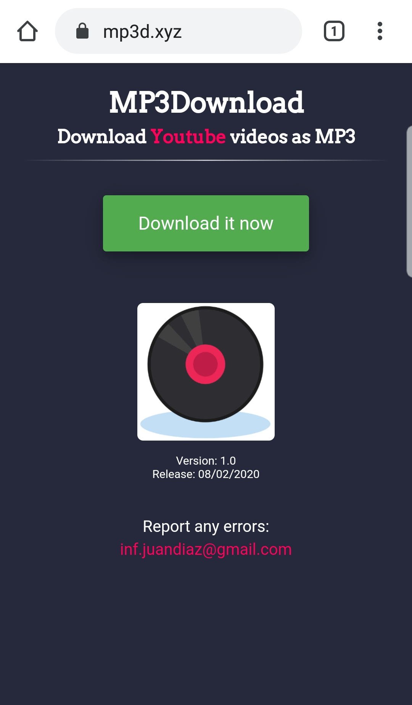
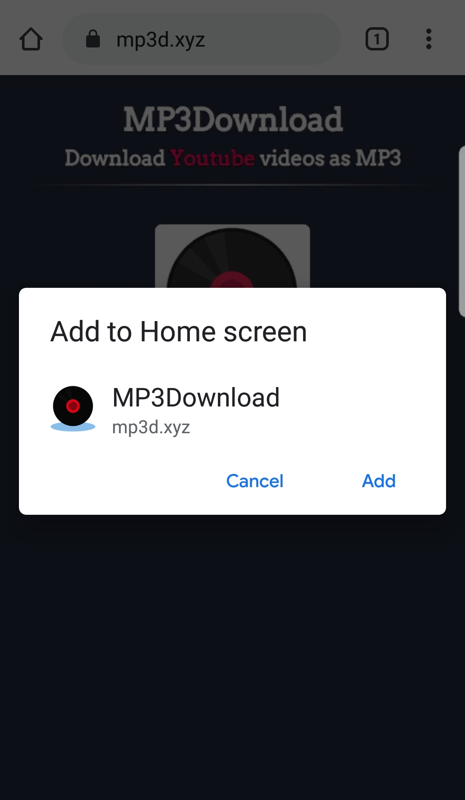
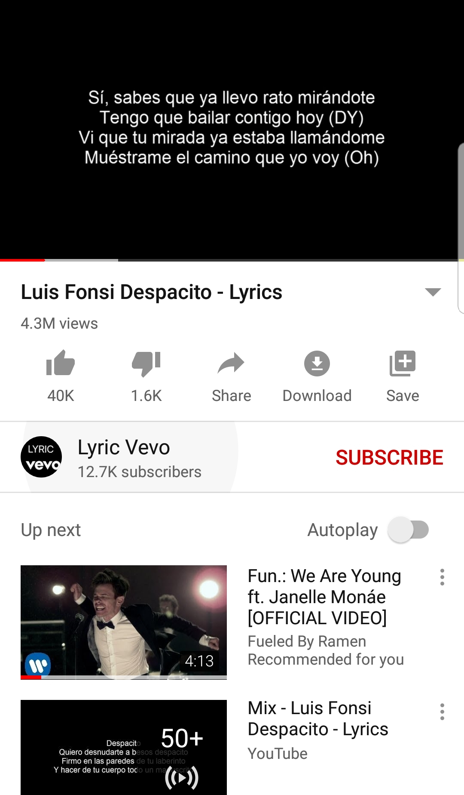
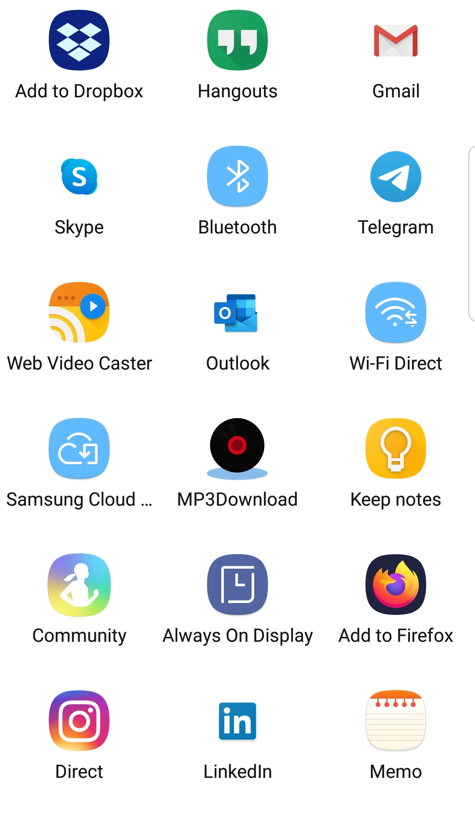
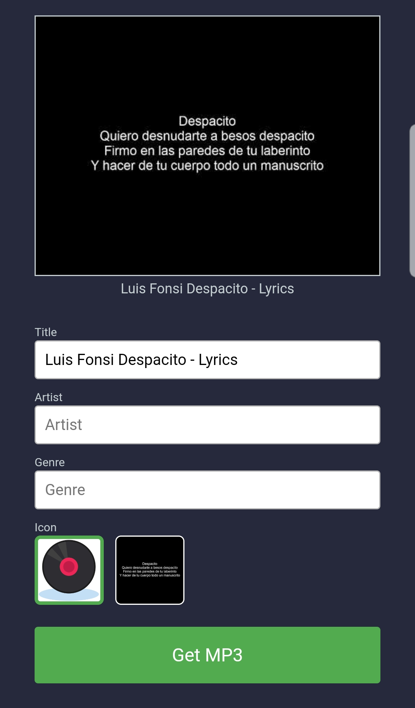

# MP3Download
MP3Download is a Progressive Web App that allows you to download any Youtube video as MP3 file

- Operating Systems: Android
- Browser: Google Chrome

Note: It may be available for other browsers if they allow to install PWA as application, not as shortcut

## Installation
1. Go to: https://mp3d.xyz

2. 
Click on 'Download it now'

3. 
Add the application (Not as shortcut)

4. 
Go to a Youtube video you want to download and click 'Share'

5. 
Choose to share with MP3Download

6. 
Use the fields to choose tags (optional) and click 'Get MP3'
